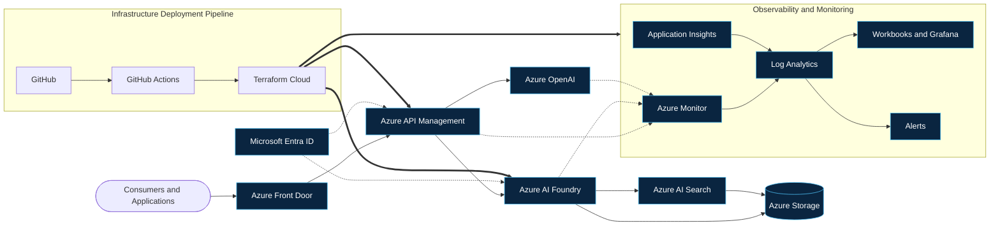

 

**Building scalable cloud infrastructure, AI platforms, observability solutions, and infrastructure automation on Microsoft Azure.**

 

---

## About Me

I am working as a **Cloud & AI Platform Engineer** in Bengaluru, India. I design, automate, and operate Azure-based enterprise platforms, with hands-on experience across AI platform operations, monitoring, and Infrastructure as Code.

<table>
<tr>
<td width="50%" valign="top">

- **Azure Infrastructure:** Multi-environment deployments and day-to-day platform operations
- **AI Platform Operations:** Azure AI Foundry, Azure OpenAI, AI Search, and APIM-fronted services
- **Platform Reliability:** Incident management, alerting, and operational readiness
- **Terraform:** Reusable modules and Terraform Cloud driven deployments

</td>
<td width="50%" valign="top">

- **Monitoring:** Azure Monitor, Log Analytics, Application Insights, and alert rules
- **Azure Workbooks:** KQL-driven dashboards for operational visibility
- **Observability Engineering:** Metrics, logs, and dashboards that support fast diagnosis
- **Enterprise Architecture and Documentation:** Architecture diagrams, runbooks, and technical guides

</td>
</tr>
</table>

---

## Technology Stack

 

| Domain | Technologies |
|:--|:--|
| **Cloud** |         |
| **Infrastructure** |   |
| **Observability** |      |
| **Platform Services** |   |
| **Automation** |       |
| **Operating Systems** |   |

---

## Professional Highlights

<table>
<tr>
<td width="33%" valign="top">

### ☁ Azure Infrastructure Engineering
Operating and evolving Azure environments with consistency, scalability, and governance across environments.

</td>
<td width="33%" valign="top">

### ⚙ Terraform Automation
Modular Infrastructure as Code with Terraform Cloud and GitHub Actions for repeatable deployments.

</td>
<td width="33%" valign="top">

### 📊 Observability Engineering
KQL queries, Azure Workbooks, and monitoring dashboards that turn telemetry into operational insight.

</td>
</tr>
<tr>
<td width="33%" valign="top">

### 🤖 AI Platform Operations
Running Azure AI Foundry, Azure OpenAI, and AI Search based platforms with monitoring and API-level control.

</td>
<td width="33%" valign="top">

### 🔐 Cloud Security & Governance
Identity-first access with Entra ID, gateway-enforced policies, and governance-aligned platform operations.

</td>
<td width="33%" valign="top">

### 🚀 Infrastructure Deployments
Automated, multi-environment rollouts with consistent configuration and pipeline-driven delivery.

</td>
</tr>
</table>

---

## Architecture Experience

| Architecture Area | Focus |
|:--|:--|
| **Azure AI Platform Architecture** | AI Foundry, Azure OpenAI, AI Search, and storage integrated as one governed platform |
| **Multi-Tenant Architecture** | Workload isolation, consistent onboarding patterns, and per-tenant operational visibility |
| **APIM Gateway Architecture** | Central API entry point with policy control, authentication, throttling, and telemetry |
| **Observability Architecture** | Metrics, logs, and traces centralized in Log Analytics and surfaced through Workbooks and Grafana |
| **Monitoring Architecture** | Azure Monitor alert rules, action groups, and health signals aligned to incident management |
| **Infrastructure Deployment Pipelines** | GitHub Actions and Terraform Cloud delivering multi-environment infrastructure |

---

## Featured Projects

### 1. Azure Workbook Deployment Automation

Terraform-based deployment architecture for Azure Monitor Workbooks, enabling multi-environment dashboard deployments.

- **Architecture highlights:** Workbook definitions managed as code, parameterized per environment, deployed through a consistent pipeline
- **Technologies:**
  
  
  
  

 

### 2. Terraform Azure Foundry Infrastructure

Reusable Infrastructure-as-Code solutions for Azure AI Foundry, monitoring, governance, networking, and operational automation.

- **Architecture highlights:** Composable Terraform modules covering AI Foundry resources, diagnostics, network configuration, and governance controls
- **Technologies:**
  
  
  

 

### 3. AAIP Enterprise AI Platform Operations

Enterprise-scale AI platform operations using Azure AI Foundry, Azure OpenAI, APIM, Log Analytics, Application Insights, and monitoring solutions.

- **Architecture highlights:** APIM-fronted AI services, centralized telemetry in Log Analytics, operational dashboards, and alerting aligned to incident management
- **Technologies:**
  
  
  
  

---

## GitHub Analytics

 

 

 

  

---

## Learning Journey

| Focus Area | Status | Progress |
|:--|:--:|:--|
| Azure Administration | ✅ |  |
| Terraform Advanced Modules | ✅ |  |
| Azure DevOps | ✅ |  |
| Azure AI Foundry | ✅ |  |
| Docker | ✅ |  |
| Kubernetes | ✅ |  |
| Site Reliability Engineering (SRE) | ✅ |  |
| Platform Engineering | ✅ |  |
| AI Infrastructure | ✅ |  |
| Generative AI Operations (GenAIOps) | ✅ |  |

---

## Certifications

| Certification | Status |
|:--|:--|
| **AZ-900** Microsoft Azure Fundamentals |  |
| **AZ-104** Azure Administrator Associate |  |
| **AZ-500** Azure Security Engineer Associate |  |
| **Terraform Associate** HashiCorp Certified |  |
| **ITIL Foundation** |  |
| **AI Certifications** |  |

---

## Professional Badges

---

## Contact

---

Engineering resilient cloud infrastructure, scalable AI platforms, and intelligent observability solutions on Microsoft Azure.

